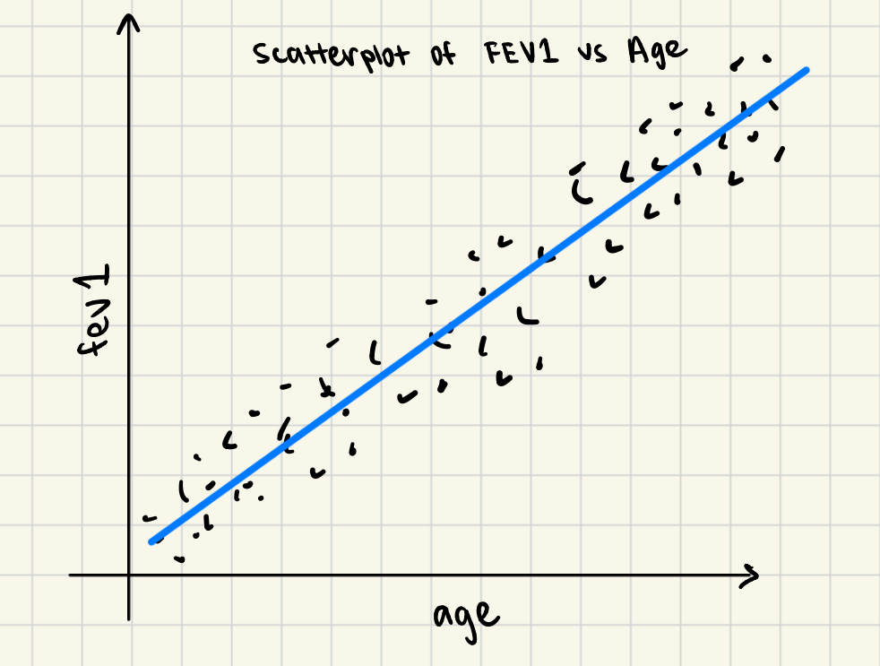
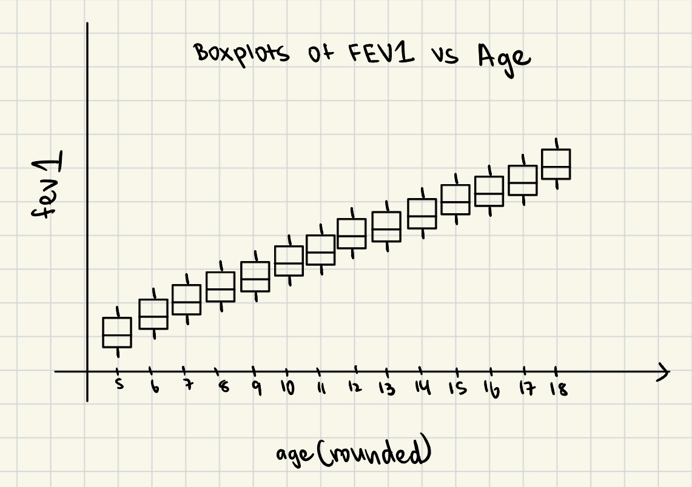

## Juhi Malwade

### Setup

Read in the data with `read_csv()` and store the data as an R object named `dataset`. Check the data to make sure all of the expected observations and variables are there.


```{r, message=FALSE, warning=FALSE}
## Load the data and any necessary packages here.
library(tidyverse)
library(ggplot2)
library(knitr)
dataset = read_csv('maacs.csv.gz')
```

## Part 1

We will first consider the relationship between FEV1 and age. In general, it is expected that as children get older (and hence, larger in size), their FEV1 values should get higher. 

Consider the statement "FEV1 values in children are higher in older children relative to younger children". 

Write a function in R that takes the `dataset` object as an argument and returns `TRUE` if the statement above is true for the dataset and `FALSE` otherwise. 

NOTE: In order to write this function, you will need to translate the statement above into something that can be checked with the data. There are many ways in which you can do that translation correctly and you only need to pick one way here. 

NOTE: For this part, do not use any plots.

```{r,message=FALSE, warning=FALSE}
## Write your function here
FEV1_age = function(dataset) {
  younger = dataset[dataset$age < 13,]
  older = dataset[dataset$age >= 13,]
  
  FEV1_young = mean(younger$fev1, na.rm = TRUE)
  FEV1_old = mean(older$fev1, na.rm = TRUE)
  
  if (FEV1_old > FEV1_young) {
    return(TRUE)
  }
  else {
    return(FALSE)
  }
}  

FEV1_age(dataset)

```


## Part 2

Fit a linear regression model with FEV1 as the outcome and age as a predictor.

How much does FEV1 change for a 1-year increase in the child's age? 

```{r,message=FALSE, warning=FALSE}
lm(dataset$fev1 ~ dataset$age)
```
The linear regression model has FEV1 as the outcome and age as a predictor. The slope of this model is 0.171162. This means for every 1-year increase in the child's age, the model predicts that FEV1 will increase by 0.171162.

## Part 3

Develop **three** supporting premises derived from the data that support the statement you wrote in Part 2. These can be plots, other summary statistics, or model results. 

NOTE: 

* At least one supporting premise should use a plot.

* Do not use the code you write in Part 1 as a supporting premise

```{r, message=FALSE, warning=FALSE}

#Premise 1
ggplot(dataset) + 
  aes(x = age, y = fev1) + 
  geom_point() + 
  geom_smooth(method = "lm") + 
  labs(title = "Fev1 vs Age")

#Premise 2
data_rounded = dataset
data_rounded$age = round(data_rounded$age)

ggplot(data_rounded) + 
  aes(x= factor(age), y=fev1) + 
  geom_boxplot() + 
  labs(title = "Fev1 vs Age", x = "age (rounded)")

#Premise 3
cor(dataset$fev1, dataset$age, use = "complete.obs")
```

Write the three supporting premise statements here:

1. The line of best fit passing through the scatterplot of FEV1 vs age has a positive slope, indicating that as age increased, the FEV1 values also increased.

2. The boxplots of the distribution of FEV1 values have higher medians for older ages compared to younger ages.

3. The correlation between FEV1 and age is 0.806, indicating a strong, positive correlation and that FEV1 increases with age. 


## Part 4

For each of the supporting premises above, write a function that takes the `dataset` object as an argument and returns `TRUE` if the supporting premise statement above is true for the dataset and `FALSE` otherwise. 

For statements involving plots, instead of returning `TRUE` or `FALSE`, you function should do two things:

1. Produce the plot that is used in the statement

2. Produce a hypothetical version of the plot in the event that the statement is true. This can be done using simulated data or by simply hand drawing a plot.


```{r,message=FALSE, warning=FALSE}
## Function for supporting premise statement 1

premise1 <- function(dataset) {
  scatter <- ggplot(dataset) + 
    aes(x = age, y = fev1) + 
    geom_point() + 
    geom_smooth(method = "lm") + 
    labs(title = "Scatterplot of Fev1 vs Age")
  print(scatter)
  
  
}

premise1(dataset)
```


```{r,message=FALSE, warning=FALSE}
## Function for supporting premise statement 2

premise2 = function(dataset) {
  data_rounded = dataset
  data_rounded$age = round(data_rounded$age)

  boxplots = ggplot(data_rounded) + 
    aes(x= factor(age), y=fev1) + 
    geom_boxplot() + 
    labs(title = "Boxplots of Fev1 vs Age", x = "age (rounded)")
  print(boxplots)
  
  
}

premise2(dataset)

```


```{r,message=FALSE, warning=FALSE}
## Function for supporting premise statement 3

premise3 <- function(dataset) {
  corr <- cor(dataset$fev1, dataset$age, use = "complete.obs")
  return(corr > 0)
}

premise3(dataset)

```


## Part 5

Describe one alternative to the primary statement "FEV1 values in children are higher in older children relative to younger children". 

Create a fault tree for the alternative outcome describing how the alternative outcome could be realized in the data even if the primary statement were true.

Your fault tree should be created as a separate image and does not need to be created in R. Upload the image of the fault tree to Canvas.

#### Alternative: FEV1 values in children are not higher in older children relative to younger children.

